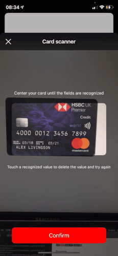
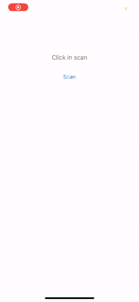

# CardScanner
[](https://cocoapods.org/pods/CardScanner)
[](https://cocoapods.org/pods/CardScanner)
[](https://cocoapods.org/pods/CardScanner)

## Example

To run the example project, clone the repo, and run `pod install` from the Example directory first.

|   |   |   |
|---|---|---|
||||


## Requirements

- iOS 13 or newer
- Swift 5

## Installation

CardScanner is available through [CocoaPods](https://cocoapods.org). To install
it, simply add the following line to your Podfile:

```ruby
pod 'CardScanner'
```

To Use:


```Swift
import CardScanner 
```

And simple call 

```Swift
let scannerView = CardScanner.getScanner { card, date, cvv in
    self.resultsLabel.text = "\(card) \(date) \(cvv)"
}
present(scannerView, animated: true, completion: nil)
```

Currently working with:
- Number 15 or 16 digits
- CVV 3 digits
- Date MM/YYYY or MM/YY


Do not forget add `NSCameraUsageDescription` to your Info.plist

You can custom the texts using the scannerView.:

- hintTopText
- hintBottomText
- buttonConfirmTitle
- buttonConfirmBackgroundColor

## Author

Narlei Moreira, narlei.guitar@gmail.com

If do you like, give your ⭐️

## License

CardScanner is available under the MIT license. See the LICENSE file for more info.

## Pay me a coffee:

[](https://www.paypal.com/cgi-bin/webscr?cmd=_donations&business=NMQM9R9GLZQXC&lc=BR&item_name=Narlei%20Moreira&item_number=development%2fdesign&currency_code=BRL&bn=PP%2dDonationsBF%3abtn_donateCC_LG%2egif%3aNonHosted)