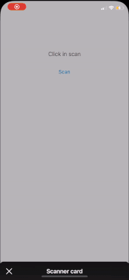

# CardScanner
[](https://cocoapods.org/pods/CardScanner)
[](https://cocoapods.org/pods/CardScanner)
[](https://cocoapods.org/pods/CardScanner)

## Example

To run the example project, clone the repo, and run `pod install` from the Example directory first.



## Requirements

- iOS 13 or newer
- Swift 5

## Installation

CardScanner is available through [CocoaPods](https://cocoapods.org). To install
it, simply add the following line to your Podfile:

```ruby
pod 'CardScanner'
```

To Use:


```Swift
import CardScanner 
```

And simple call 

```Swift
let scannerView = CardScanner.getScanner { card, date, cvv in
    self.resultsLabel.text = "\(card) \(date) \(cvv)"
}
present(scannerView, animated: true, completion: nil)
```

Do not forget add `NSCameraUsageDescription` to your Info.plist

You can custom the texts using the scannerView.:
- hintTopText
- hintBottomText
- buttonConfirmTitle
- buttonConfirmBackgroundColor

## Author

Narlei Moreira, narlei.guitar@gmail.com

## License

CardScanner is available under the MIT license. See the LICENSE file for more info.
